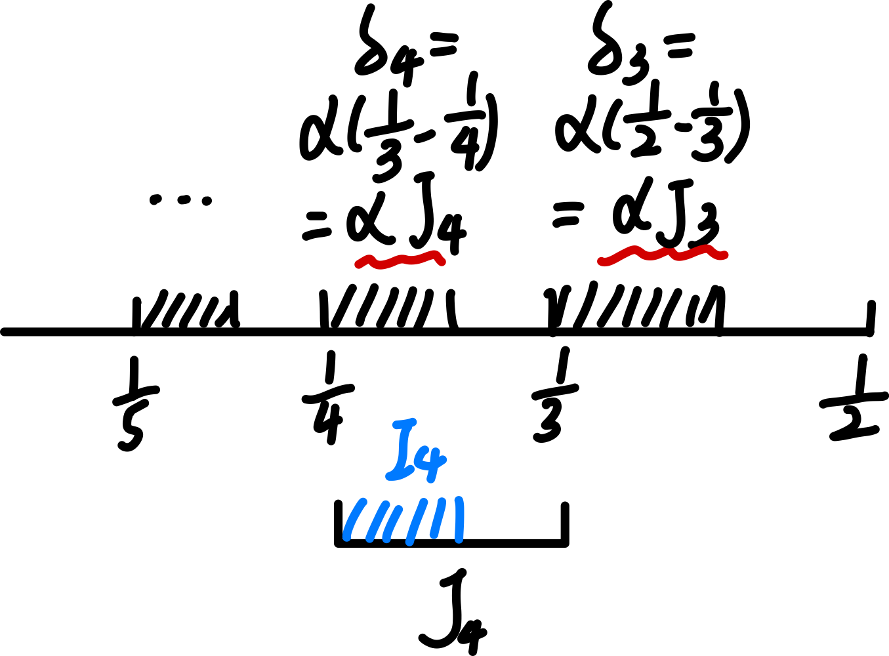
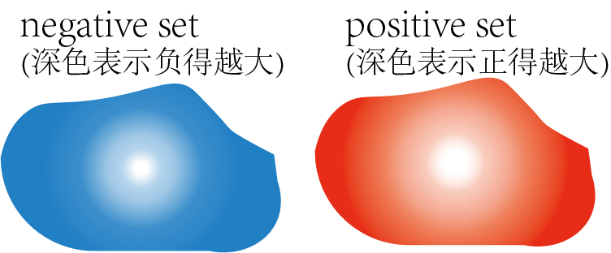
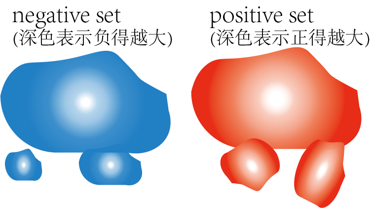
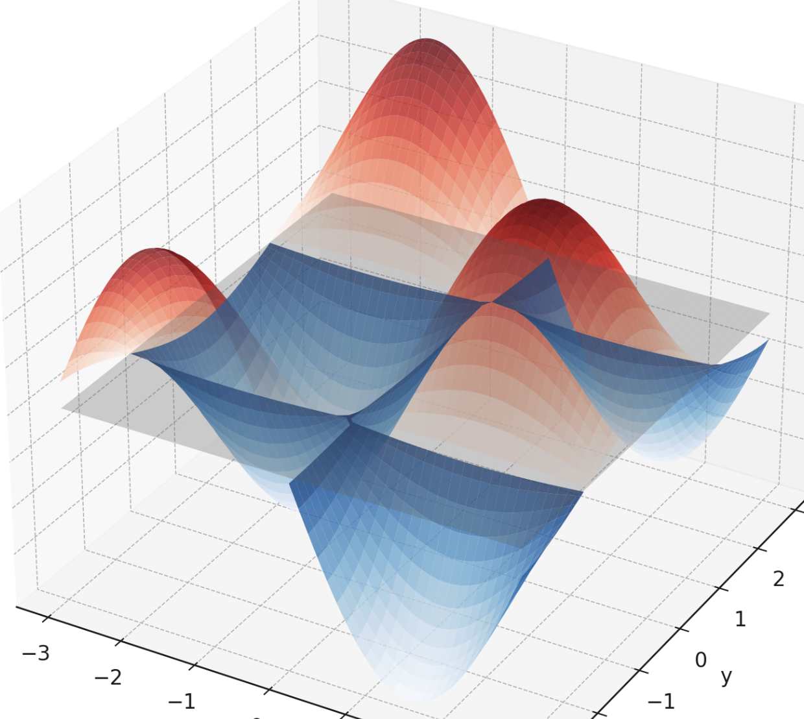
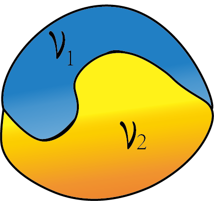

```python
import numpy as np
import matplotlib.pyplot as plt
from mpl_toolkits.mplot3d import Axes3D

# Define the function from R^2 to R
def f(x, y):
    return np.sin(x) * np.cos(y)  # has both positive and negative values

# Generate grid over R^2
x = np.linspace(-3, 3, 100)
y = np.linspace(-3, 3, 100)
X, Y = np.meshgrid(x, y)
Z = f(X, Y)

# Create mask for positive and negative regions
Z_positive = np.where(Z > 0, Z, np.nan)
Z_negative = np.where(Z <= 0, Z, np.nan)

# Plotting
fig = plt.figure(figsize=(10, 8))
ax = fig.add_subplot(111, projection='3d')

# Plot positive surface
ax.plot_surface(X, Y, Z_positive, cmap='Reds', edgecolor='none', alpha=0.8, label='Positive region')

# Plot negative surface
ax.plot_surface(X, Y, Z_negative, cmap='Blues', edgecolor='none', alpha=0.8, label='Negative region')

# Plot the z=0 plane
ax.plot_surface(X, Y, np.zeros_like(Z), color='gray', alpha=0.3)

# Labels
ax.set_title("Visualization of a Signed Function on R^2", fontsize=14)
ax.set_xlabel("x")
ax.set_ylabel("y")
ax.set_zlabel("f(x, y)")

plt.tight_layout()
plt.show()

```


